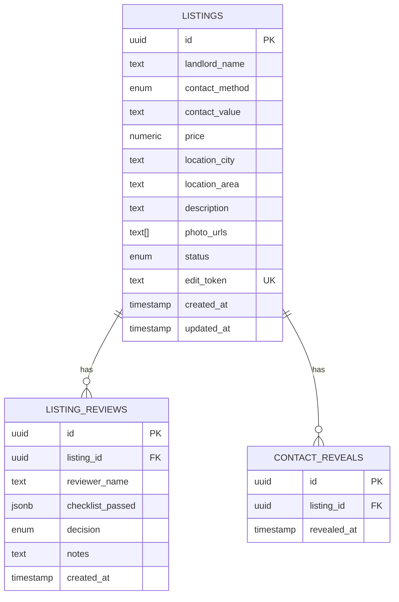

# RentDirect — API Contract & Database Schema
Week 2 Sprint Deliverable · Backend (Bun + Hono + Drizzle)

## Authentication

RentDirect has **no login system for the MVP**. Landlord identity is handled
via an **edit token**: a random, unguessable string generated when a listing
is created and returned to the landlord once. That token is their only
credential — whoever holds it can view/edit that listing via the
`/api/listings/manage/:token` routes. There is no session, password, or
account record.

Reviewer identity (who verifies a listing) is also unauthenticated for the
MVP — the reviewer's name is passed as free text on the review request. This
is a known, deliberate MVP tradeoff (see PRD assumptions).

---

## Endpoints

### `POST /api/listings`
Landlord submits a new listing.

**Request body**
```json
{
  "landlordName": "string",
  "contactMethod": "phone | whatsapp",
  "contactValue": "string",
  "price": 150000,
  "locationCity": "string",
  "locationArea": "string (optional)",
  "description": "string",
  "photoUrls": ["https://..."]
}
```

**Response `201`**
```json
{
  "listing": { "id": "uuid", "landlordName": "...", "status": "pending", "...": "..." },
  "editToken": "string — shown once, landlord must save it"
}
```

---

### `GET /api/listings`
Tenant search/browse. Defaults to `status=verified` unless a status is
explicitly requested.

**Query params**: `locationCity`, `minPrice`, `maxPrice`, `status`, `page` (default 1), `limit` (default 20, max 50)

**Response `200`**
```json
{ "data": [ { "id": "uuid", "price": "150000.00", "...": "..." } ], "page": 1, "limit": 20, "total": 42 }
```
Note: `contactValue` and `editToken` are stripped from all public listing objects.

---

### `GET /api/listings/:id`
Single listing detail (public — no contact info).

**Response `200`**: `{ "listing": { ... } }`
**Response `404`**: listing not found

---

### `POST /api/listings/:id/reveal`
Tenant reveals the landlord's contact detail. Logs a `contact_reveals` row
for the Data Analyst's success metrics.

**Response `200`**
```json
{ "contactMethod": "phone", "contactValue": "+234..." }
```

---

### `POST /api/listings/:id/review`
Reviewer applies the verified/rejected decision (manual review, no auth).

**Request body**
```json
{
  "reviewerName": "string",
  "decision": "approved | rejected",
  "checklistPassed": { "photosMatchDescription": true, "priceReasonable": true },
  "notes": "string (optional)"
}
```

**Response `200`**: `{ "review": { ... }, "status": "verified | rejected" }`

---

### `GET /api/listings/manage/:token`
Landlord's "dashboard" — full listing detail, including their own contact
info, via edit token instead of login.

**Response `200`**: `{ "listing": { ...full row... } }`
**Response `401`**: invalid/unknown token

---

### `PATCH /api/listings/manage/:token`
Landlord edits their listing via edit token. All fields optional (partial update).

**Request body**: any subset of the `POST /api/listings` fields
**Response `200`**: `{ "listing": { ...updated row... } }`
**Response `401`**: invalid/unknown token

---

## Error Codes

All errors use a consistent envelope:
```json
{ "error": { "code": "STRING_CODE", "message": "human readable", "details": {} } }
```

| HTTP Status | Code | Meaning |
|---|---|---|
| 400 | `VALIDATION_ERROR` | Request body/query failed schema validation |
| 401 | `INVALID_EDIT_TOKEN` | Edit token missing, wrong, or doesn't match a listing |
| 404 | `NOT_FOUND` | Listing or route doesn't exist |
| 409 | `CONFLICT` | Reserved for future use (e.g. duplicate submission) |
| 500 | `INTERNAL_ERROR` | Unhandled server error |

---

## Database Schema — ER Diagram



**Notes**
- `listings.edit_token` is unique and is the landlord's sole credential — no `users` table exists for the MVP.
- `contact_reveals` has no tenant reference (no tenant accounts either), so it supports *count* metrics only, not unique-tenant metrics — flagged for the Data Analyst.
- `listing_reviews` keeps a full audit trail of review decisions even though `listings.status` only reflects the latest one.

---

## Progress This Sprint

- [x] Schema defined in Drizzle (`src/db/schema.ts`): `listings`, `listing_reviews`, `contact_reveals`
- [x] Zod request/response validation for all inputs (`src/types.ts`)
- [x] Routes implemented: create, search/browse, detail, reveal, review, token-based manage (get + patch)
- [x] Consistent error envelope + error codes
- [ ] Migrations generated and run against a live Postgres instance
- [ ] Rate limiting / abuse protection on `POST /api/listings` and `/reveal` (open question — no auth means no natural throttle point yet)
- [ ] Photo upload handling (currently expects pre-hosted URLs — decide storage provider with Frontend)